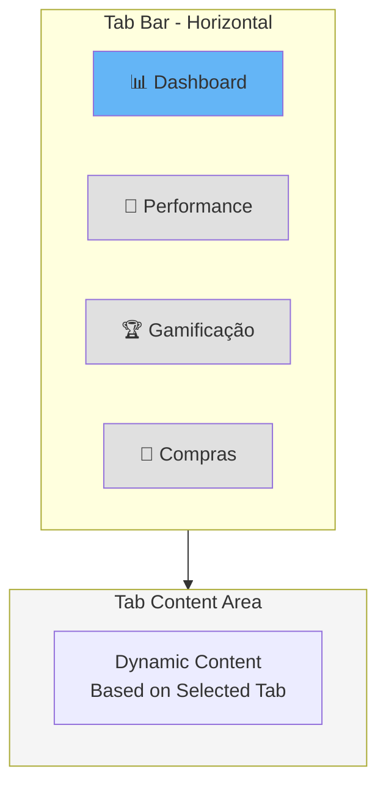
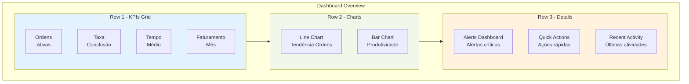
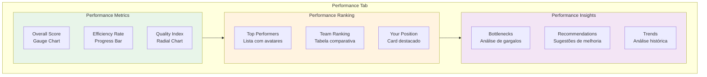
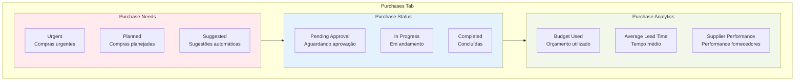
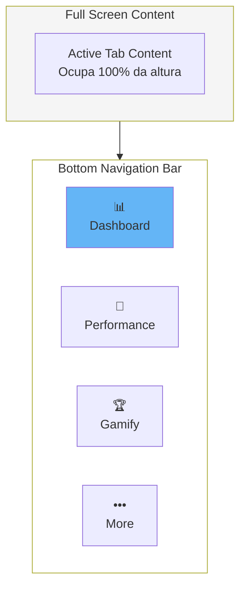
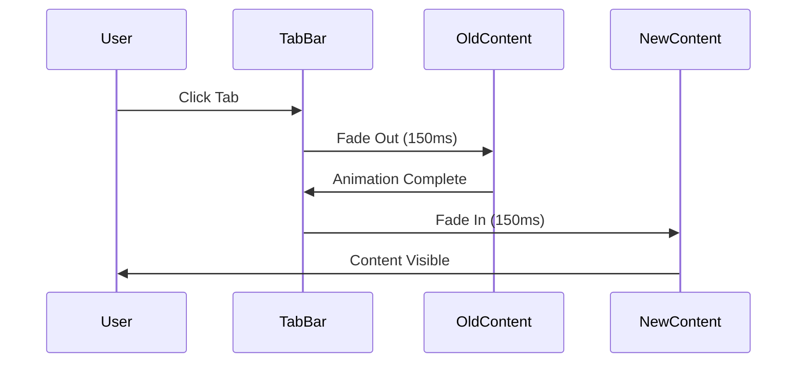

# Sistema de Abas do Dashboard - Wireframes

## 🎯 Visão Geral

Sistema de navegação por abas (tabs) que organiza diferentes visualizações do dashboard: visão geral, performance, gamificação e compras.

## 🖥️ Layout das Tabs - Desktop



### Especificações Tab Bar
- **Height**: 56px
- **Background**: `bg-background/95` (backdrop-blur)
- **Border Bottom**: 1px solid border
- **Position**: Sticky top
- **Z-index**: 10

## 📑 Tab 1: Dashboard (Visão Geral)



### Componentes Dashboard Tab
1. **KPIs Grid**: 4 colunas com métricas principais
2. **Trend Charts**: Visualização de tendências
3. **Alerts Panel**: Alertas críticos e warnings
4. **Quick Actions**: Ações contextuais rápidas
5. **Activity Feed**: Stream de atividades recentes

## 🎯 Tab 2: Performance



### Componentes Performance Tab
1. **PerformanceMetrics**: Gauges e indicadores visuais
2. **PerformanceRanking**: Rankings diário/semanal/mensal
3. **PerformanceInsights**: Análise inteligente de dados
4. **TrendAnalysis**: Gráficos de evolução temporal

### Layout Performance - Desktop
- **Grid**: 3 colunas (1fr 2fr 1fr)
- **Metrics**: Coluna esquerda (gauges verticais)
- **Ranking**: Coluna central (tabela principal)
- **Insights**: Coluna direita (cards de insights)

## 🏆 Tab 3: Gamificação

```mermaid
graph TB
    subgraph Gamification["Gamification Tab"]
        subgraph Progress["User Progress"]
            P1[Level Badge<br/>Nível atual + XP]
            P2[Progress Bar<br/>Progresso para próximo nível]
            P3[Rewards<br/>Próximas recompensas]
        end
        
        subgraph Achievements["Achievements System"]
            A1[Recent<br/>Últimas conquistas]
            A2[In Progress<br/>Em andamento]
            A3[Locked<br/>Bloqueadas]
        end
        
        subgraph Leaderboard["Leaderboard"]
            L1[Daily Leaders<br/>Ranking do dia]
            L2[Weekly Leaders<br/>Ranking da semana]
            L3[Monthly Leaders<br/>Ranking do mês]
        end
        
        subgraph Stats["Gamification Stats"]
            S1[Points Earned<br/>Total de pontos]
            S2[Streak<br/>Dias consecutivos]
            S3[Badges<br/>Conquistas desbloqueadas]
        end
    end
    
    Progress --> Achievements
    Achievements --> Leaderboard
    Leaderboard --> Stats
    
    style Progress fill:#c8e6c9
    style Achievements fill:#fff9c4
    style Leaderboard fill:#ffccbc
    style Stats fill:#d1c4e9
```



### Componentes Gamification Tab
1. **UserLevelProgress**: Badge de nível + barra de progresso
2. **AchievementSystem**: Grid de conquistas com filtros
3. **PerformanceRanking**: Leaderboards com tabs diário/semanal/mensal
4. **CelebrationAnimations**: Animações de confete quando conquista desbloqueada

### Interações Especiais
- **Achievement Unlock**: Modal com animação + confete
- **Level Up**: Animação de fogos de artifício + toast
- **New Rank**: Badge pulsante + som (opcional)

## 🛒 Tab 4: Compras



### Componentes Purchases Tab
1. **PurchaseNeedsDashboard**: Dashboard de necessidades identificadas
2. **PurchaseStatusBoard**: Kanban de status de compras
3. **BudgetTracker**: Acompanhamento de orçamento
4. **SupplierMetrics**: Métricas de fornecedores

## 📱 Layout Mobile - Bottom Navigation



### Especificações Mobile Navigation
- **Height**: 64px
- **Position**: Fixed bottom
- **Safe Area**: padding-bottom: env(safe-area-inset-bottom)
- **Icons**: 24x24px
- **Labels**: 12px
- **Active State**: Primary color + bold

### Gestures Mobile
- **Swipe Left/Right**: Navegar entre tabs
- **Pull to Refresh**: Atualizar dados
- **Long Press**: Menu contextual (se aplicável)

## 🎨 Estados das Tabs

### Tab Ativa
```css
.tab-active {
  color: hsl(var(--primary));
  border-bottom: 2px solid hsl(var(--primary));
  font-weight: 600;
}
```

### Tab Inativa
```css
.tab-inactive {
  color: hsl(var(--muted-foreground));
  border-bottom: 2px solid transparent;
  font-weight: 400;
}
```

### Tab Hover (Desktop)
```css
.tab:hover {
  color: hsl(var(--foreground));
  background: hsl(var(--accent) / 0.5);
  border-radius: 8px 8px 0 0;
}
```

## 🔄 Transições entre Tabs

### Animação de Troca


### CSS Transitions
```css
.tab-content {
  opacity: 0;
  transform: translateY(8px);
  transition: all 200ms ease-in-out;
}

.tab-content.active {
  opacity: 1;
  transform: translateY(0);
}
```

## ♿ Acessibilidade

### ARIA Roles
```html
<div role="tablist" aria-label="Dashboard Tabs">
  <button 
    role="tab" 
    aria-selected="true" 
    aria-controls="dashboard-panel"
    id="dashboard-tab"
  >
    Dashboard
  </button>
</div>

<div 
  role="tabpanel" 
  aria-labelledby="dashboard-tab"
  id="dashboard-panel"
>
  <!-- Tab Content -->
</div>
```

### Keyboard Navigation
- **Tab**: Navegar entre tabs
- **Enter/Space**: Ativar tab
- **Arrow Left/Right**: Navegar horizontalmente
- **Home**: Primeira tab
- **End**: Última tab

## 📊 Performance

### Lazy Loading
- Tab content carregado sob demanda
- Skeleton placeholders durante loading
- Cache de conteúdo já visitado

### Otimizações
- Virtual scrolling para listas longas
- Memoization de componentes pesados
- Debounce em filtros e buscas
- Image lazy loading

## 🔗 Links Relacionados

- [Main Dashboard](./main-dashboard.md)
- [Tab System Implementation](../technical-specs/tabs-system-implementation.md)
- [User Flows](../user-flows/dashboard-user-journey.md)

---

*Última atualização: 2025-10-09*
