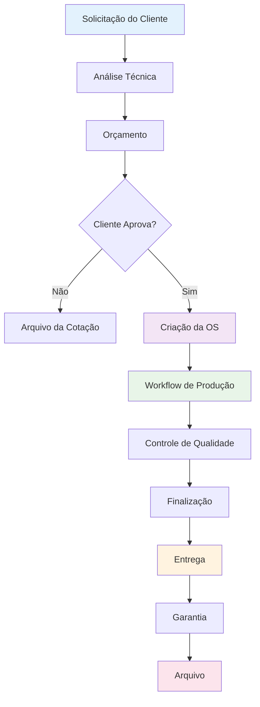
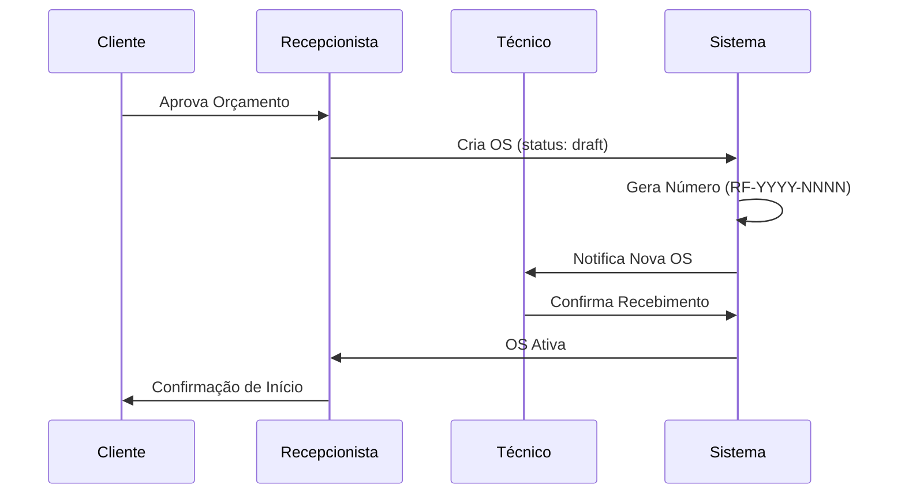
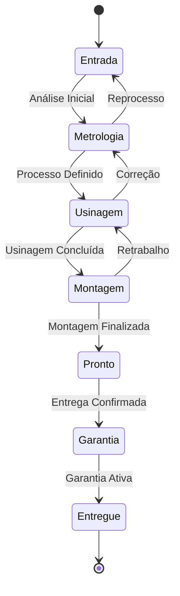
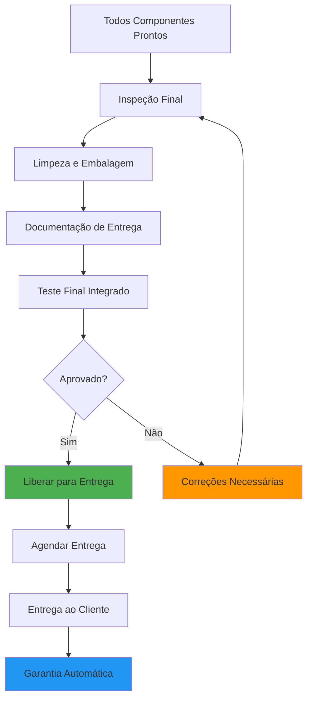

# Processo de Ordens de Serviço

Esta documentação detalha o processo completo de gestão de ordens de serviço no módulo Operações & Serviços, incluindo criação, execução, controle e finalização.

## 🎯 Visão Geral do Processo

O processo de ordens de serviço é o núcleo operacional do sistema, gerenciando desde a entrada do cliente até a entrega final do serviço, passando por todas as etapas de produção e controle de qualidade.



## 📋 Fluxo Detalhado do Processo

### 1. **Recepção e Análise Inicial**

#### 1.1 Entrada do Cliente
- **Agendamento**: Sistema de agendamento online ou telefônico
- **Recepção**: Atendimento personalizado na oficina
- **Diagnóstico Inicial**: Avaliação técnica preliminar
- **Documentação**: Registro de dados do cliente e veículo

#### 1.2 Análise Técnica
```typescript
interface TechnicalAnalysis {
  vehicle: {
    make: string;
    model: string;
    year: number;
    engine: string;
    mileage: number;
  };
  components: {
    type: EngineComponent;
    condition: 'excellent' | 'good' | 'fair' | 'poor' | 'critical';
    issues: string[];
    photos: string[];
  }[];
  recommendations: {
    priority: 'high' | 'medium' | 'low';
    service: string;
    reason: string;
    cost_estimate: number;
  }[];
}
```

#### 1.3 Geração de Orçamento
- **Cálculo Automático**: Base de dados de tempos e materiais
- **Margem de Contribuição**: Aplicação de markup personalizado
- **Prazos**: Estimativa baseada em capacidade atual
- **Alternativas**: Diferentes níveis de serviço quando aplicável

### 2. **Criação da Ordem de Serviço**

#### 2.1 Aprovação do Cliente


#### 2.2 Estrutura da Ordem
```sql
-- Tabela principal de ordens
CREATE TABLE orders (
  id UUID PRIMARY KEY DEFAULT gen_random_uuid(),
  order_number TEXT UNIQUE NOT NULL,
  customer_id UUID REFERENCES customers(id),
  vehicle_data JSONB NOT NULL,
  estimated_completion DATE,
  total_estimate DECIMAL(10,2),
  status order_status DEFAULT 'draft',
  priority priority_level DEFAULT 'medium',
  assigned_to UUID REFERENCES auth.users(id),
  created_at TIMESTAMP DEFAULT now(),
  org_id UUID NOT NULL
);
```

#### 2.3 Criação Automática de Workflows
```typescript
// Trigger automático para criação de workflows
const createDefaultWorkflow = async (orderId: string) => {
  const components: EngineComponent[] = [
    'bloco', 'eixo', 'biela', 'comando', 'cabecote'
  ];
  
  for (const component of components) {
    await supabase
      .from('order_workflow')
      .insert({
        order_id: orderId,
        component,
        status: 'entrada',
        created_at: new Date()
      });
  }
};
```

### 3. **Execução do Workflow**

#### 3.1 Gestão por Componente
Cada componente segue seu workflow específico:



#### 3.2 Controle de Progresso
- **Kanban Visual**: Interface drag-and-drop para operadores
- **Tempo Real**: Atualizações automáticas de status
- **Alertas**: Notificações para desvios de prazo
- **Rastreabilidade**: Log completo de mudanças

#### 3.3 Gestão de Materiais
```typescript
interface MaterialUsage {
  order_id: string;
  component: EngineComponent;
  materials: {
    part_number: string;
    description: string;
    quantity: number;
    unit_cost: number;
    supplier: string;
    lot_number?: string;
  }[];
  labor_hours: number;
  total_cost: number;
}
```

### 4. **Controle de Qualidade**

#### 4.1 Inspeção por Etapa
- **Entrada**: Documentação fotográfica e medições iniciais
- **Processo**: Controles dimensionais e visuais contínuos
- **Finalização**: Teste funcional e aprovação final

#### 4.2 Critérios de Aprovação
```typescript
interface QualityCheck {
  checkpoint: string;
  criteria: {
    parameter: string;
    specification: string;
    measured_value: number;
    tolerance: number;
    status: 'pass' | 'fail' | 'rework';
  }[];
  inspector: string;
  timestamp: Date;
  photos: string[];
  notes: string;
}
```

#### 4.3 Tratamento de Não-Conformidades
- **Detecção**: Identificação durante inspeção
- **Classificação**: Crítica, major ou minor
- **Ação Corretiva**: Retrabalho ou substituição
- **Verificação**: Re-inspeção obrigatória

### 5. **Finalização e Entrega**

#### 5.1 Preparação para Entrega


#### 5.2 Documentação de Entrega
- **Relatório Técnico**: Serviços executados e especificações
- **Fotos Comparativas**: Antes e depois do serviço
- **Certificado de Qualidade**: Parâmetros medidos e aprovados
- **Manual de Garantia**: Termos e condições

#### 5.3 Processo de Entrega
```typescript
interface DeliveryProcess {
  delivery_date: Date;
  delivery_method: 'pickup' | 'delivery' | 'shipping';
  recipient: {
    name: string;
    document: string;
    signature: string;
  };
  items_delivered: {
    component: EngineComponent;
    serial_number?: string;
    warranty_months: number;
  }[];
  customer_satisfaction: {
    rating: number; // 1-5
    comments: string;
    would_recommend: boolean;
  };
}
```

### 6. **Gestão de Garantia**

#### 6.1 Ativação Automática
```typescript
// Trigger para criação automática de garantia
const createOrderWarranty = async (orderId: string) => {
  const order = await getOrder(orderId);
  
  if (order.status === 'entregue') {
    await supabase
      .from('order_warranties')
      .insert({
        order_id: orderId,
        warranty_type: 'total',
        start_date: new Date(),
        end_date: addMonths(new Date(), 3), // 3 meses padrão
        terms: 'Garantia padrão para serviços executados',
        org_id: order.org_id
      });
  }
};
```

#### 6.2 Acompanhamento de Garantia
- **Monitoramento Automático**: Alertas 15 dias antes do vencimento
- **Registro de Ocorrências**: Log de chamados durante a garantia
- **Análise de Qualidade**: Índices de retorno por tipo de serviço
- **Extensão Automática**: Para casos especiais pré-configurados

### 7. **KPIs e Métricas do Processo**

#### 7.1 Indicadores Operacionais
```typescript
interface ProcessKPIs {
  lead_time: {
    average_days: number;
    by_component: Record<EngineComponent, number>;
    trend: 'improving' | 'stable' | 'declining';
  };
  quality: {
    rework_rate: number;
    customer_satisfaction: number;
    warranty_claims: number;
  };
  productivity: {
    orders_per_day: number;
    utilization_rate: number;
    efficiency_index: number;
  };
}
```

#### 7.2 Dashboard Gerencial
- **Ordens em Andamento**: Status atual por componente
- **Bottlenecks**: Identificação de gargalos
- **Previsão de Entrega**: Baseada em progresso atual
- **Rentabilidade**: Margem por ordem e período

### 8. **Automações e Integrações**

#### 8.1 Notificações Automáticas
- **Cliente**: Status de progresso via WhatsApp/SMS
- **Equipe**: Alertas de prazo e prioridade
- **Gestão**: Relatórios executivos periódicos

#### 8.2 Integrações de Sistema
- **Financeiro**: Faturamento automático na entrega
- **Estoque**: Baixa automática de materiais
- **CRM**: Histórico completo do cliente
- **Fiscal**: Documentação fiscal automática

## 📊 Métricas de Performance

### Benchmarks do Processo
| Métrica | Meta | Atual | Status |
|---------|------|-------|--------|
| Lead Time Médio | 8 dias | 9.2 dias | ⚠️ |
| Taxa de Retrabalho | < 5% | 3.8% | ✅ |
| Satisfação Cliente | > 9.0 | 9.3 | ✅ |
| Entregas no Prazo | > 95% | 92% | ⚠️ |
| Margem Média | > 40% | 43% | ✅ |

### Plano de Melhoria Contínua
1. **Redução de Lead Time**: Otimização de setup entre operações
2. **Melhoria de Qualidade**: Implementação de poka-yoke
3. **Satisfação Cliente**: Sistema de feedback em tempo real
4. **Pontualidade**: Melhoria na estimativa de prazos
5. **Rentabilidade**: Otimização de custos de material

---

*Última atualização: 23/09/2025*