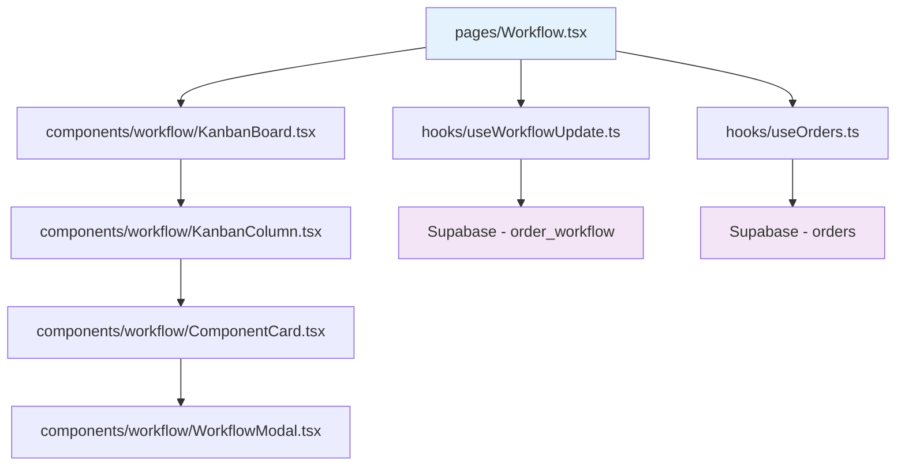

# Arquitetura de Componentes - Módulo Operações & Serviços

## 🏗️ Visão Geral da Arquitetura



## 📦 Componentes Principais

### **KanbanBoard**: Interface principal drag-and-drop
### **ComponentCard**: Cartão individual de workflow  
### **WorkflowModal**: Modal de detalhes e edição

## 🔗 Hooks e Integrações

### **useWorkflowUpdate**: Gestão de estados e transições
### **useOrders**: Gerenciamento de ordens de serviço
### **@hello-pangea/dnd**: Biblioteca drag-and-drop

## 🗄️ Estrutura de Dados

```typescript
interface WorkflowItem {
  id: string;
  order_id: string;
  component: EngineComponent;
  status: WorkflowStatus;
  assigned_to?: string;
  started_at?: Date;
  completed_at?: Date;
}

enum EngineComponent {
  BLOCO = 'bloco',
  EIXO = 'eixo', 
  BIELA = 'biela',
  COMANDO = 'comando',
  CABECOTE = 'cabecote'
}
```

## ⚡ Performance e Responsividade

- **Mobile-first**: Layout adaptativo
- **Lazy loading**: Carregamento otimizado
- **Real-time updates**: Sincronização automática
- **Error handling**: Recuperação de falhas

---

*Documentação técnica completa do sistema de workflows operacionais.*