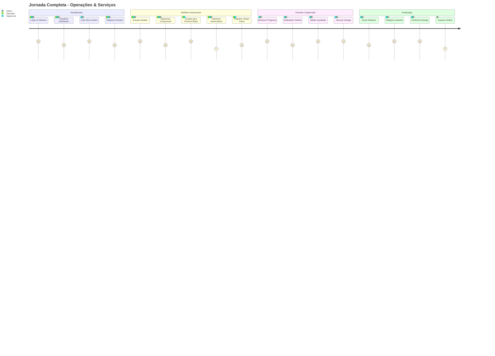
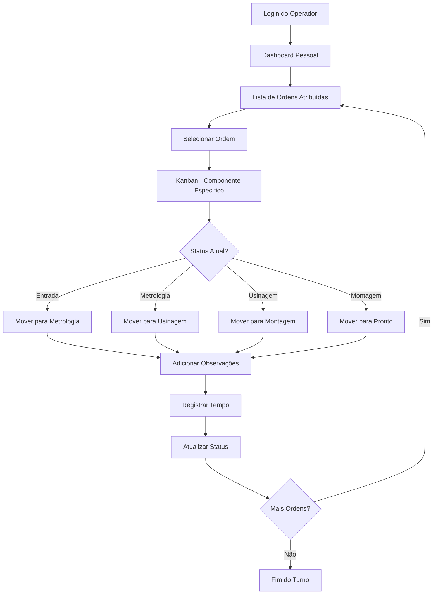
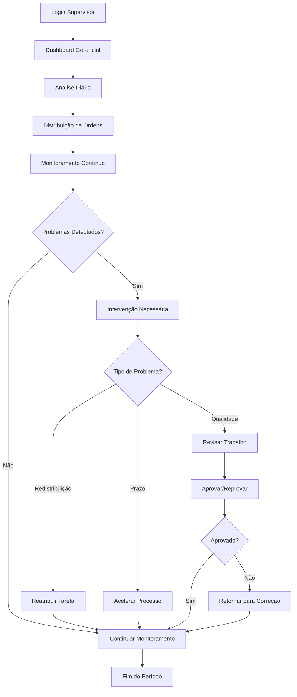

# Jornada do Usuário - Operações & Serviços

Esta documentação detalha as jornadas completas dos usuários no módulo Operações & Serviços, considerando diferentes personas e seus respectivos fluxos de trabalho.

## 👥 Personas do Sistema

### 🔧 Operador de Produção
**Responsabilidades**: Execução de tarefas operacionais, atualização de status, registro de atividades
**Permissões**: Visualizar ordens, atualizar status de componentes, adicionar observações

### 👨‍💼 Supervisor de Operações  
**Responsabilidades**: Supervisão de workflows, redistribuição de tarefas, controle de qualidade
**Permissões**: Todas do operador + criar/editar ordens, gerenciar atribuições, aprovar entregas

### 👨‍💻 Administrador do Sistema
**Responsabilidades**: Configuração completa, relatórios gerenciais, auditoria
**Permissões**: Acesso total ao sistema, configurações avançadas, relatórios executivos

## 🚀 Jornada Multi-Persona

## 📱 Fluxo Detalhado por Persona

### 🔧 Jornada do Operador de Produção

#### 1. Início do Turno
- **Login** → Autenticação biométrica ou credenciais
- **Dashboard** → Visualização de ordens atribuídas
- **Priorização** → Ordenação por urgência e prazo

#### 2. Execução Operacional
- **Seleção de Ordem** → Escolha da próxima tarefa
- **Kanban Board** → Visualização do status atual
- **Drag & Drop** → Movimento entre etapas do workflow
- **Registro de Tempo** → Controle automático de horas

#### 3. Documentação
- **Fotos do Progresso** → Registro visual das etapas
- **Observações Técnicas** → Anotações sobre dificuldades
- **Materiais Utilizados** → Registro de peças e consumíveis

### 👨‍💼 Jornada do Supervisor de Operações

#### 1. Planejamento Diário
- **Dashboard Gerencial** → Visão geral de todas as ordens
- **Análise de Capacidade** → Distribuição de cargas de trabalho
- **Priorização Estratégica** → Definição de prioridades do dia

#### 2. Gestão de Workflow
- **Monitoramento em Tempo Real** → Acompanhamento do progresso
- **Redistribuição de Tarefas** → Balanceamento de carga
- **Resolução de Bloqueios** → Intervenção em problemas

#### 3. Controle de Qualidade
- **Revisão de Etapas** → Validação antes da próxima fase
- **Aprovação de Entregas** → Controle final de qualidade
- **Gestão de Não-Conformidades** → Tratamento de problemas

### 👨‍💻 Jornada do Administrador

#### 1. Análise Estratégica
- **Relatórios Executivos** → KPIs e métricas de performance
- **Análise de Tendências** → Identificação de padrões
- **Planejamento de Recursos** → Otimização de capacidade

#### 2. Configuração do Sistema
- **Gestão de Usuários** → Criação e gerenciamento de acessos
- **Configuração de Workflows** → Customização de processos
- **Integração de Sistemas** → Configuração de APIs

#### 3. Auditoria e Compliance
- **Rastreabilidade Completa** → Histórico de todas as operações
- **Relatórios de Auditoria** → Compliance regulatório
- **Backup e Segurança** → Proteção de dados

## 📊 Métricas por Jornada

### Operador
- **Produtividade**: Ordens processadas por hora
- **Qualidade**: Taxa de retrabalho
- **Pontualidade**: Aderência aos prazos

### Supervisor
- **Eficiência da Equipe**: Performance coletiva
- **Tempo de Resolução**: Rapidez na solução de problemas
- **Taxa de Aprovação**: Qualidade das entregas

### Administrador
- **ROI do Sistema**: Retorno sobre investimento
- **Disponibilidade**: Uptime do sistema
- **Satisfação do Usuário**: NPS interno

## 🎯 Pontos de Melhoria Identificados

1. **Automação de Notificações**: Alertas proativos para desvios
2. **Interface Mobile**: Otimização para dispositivos móveis
3. **Integração com IoT**: Sensores para automação de dados
4. **IA Preditiva**: Previsão de problemas e gargalos
5. **Gamificação**: Elementos de engajamento para operadores

---

*Última atualização: 23/09/2025*