# Ciclo de Vida das Ordens de Serviço

Esta documentação detalha o ciclo completo de vida de uma ordem de serviço, desde a criação até o arquivamento, incluindo todos os estados, transições e processos envolvidos.

## 🔄 Visão Geral do Ciclo de Vida

```mermaid
stateDiagram-v2
    [*] --> Criacao: Nova Ordem
    Criacao --> Ativa: Aprovação
    Ativa --> EmAndamento: Início dos Trabalhos
    EmAndamento --> Finalizada: Conclusão
    Finalizada --> Entregue: Entrega ao Cliente
    Entregue --> EmGarantia: Período de Garantia
    EmGarantia --> Arquivada: Fim da Garantia
    Entregue --> Arquivada: Garantia Expirada
    
    Ativa --> Cancelada: Cancelamento
    EmAndamento --> Pausada: Pausa Temporária
    Pausada --> EmAndamento: Retomada
    Pausada --> Cancelada: Cancelamento
    
    Arquivada --> [*]
    Cancelada --> [*]
</ov-mermaid>

## 📋 Estados das Ordens

### 🆕 **Criação** (Rascunho)
**Status**: `draft`
**Descrição**: Ordem recém-criada, ainda em processo de definição

#### Características:
- Número de ordem ainda não gerado
- Dados básicos preenchidos
- Aguardando aprovação para início
- Editável por supervisores e administradores

#### Ações Possíveis:
- ✏️ Editar informações
- ✅ Aprovar e ativar
- ❌ Cancelar

#### Transições:
- **Para Ativa**: Aprovação pelo supervisor
- **Para Cancelada**: Cancelamento pelo administrador

---

### ⚡ **Ativa** (Aprovada)
**Status**: `ativa`
**Descrição**: Ordem aprovada e pronta para início dos trabalhos

#### Características:
- Número de ordem gerado automaticamente (RF-YYYY-NNNN)
- Workflow criado para todos os componentes
- Atribuições definidas
- Sistema de auditoria ativado

#### Ações Possíveis:
- 🚀 Iniciar trabalhos
- ✏️ Editar detalhes (limitado)
- 👥 Gerenciar atribuições
- ❌ Cancelar (com justificativa)

#### Transições:
- **Para Em Andamento**: Primeiro movimento no Kanban
- **Para Cancelada**: Cancelamento justificado

---

### 🔄 **Em Andamento** (Executando)
**Status**: `em_andamento`
**Descrição**: Trabalhos em execução, componentes em diferentes etapas

#### Características:
- Componentes em diferentes estados do workflow
- Rastreamento de tempo por etapa
- Registros de progresso
- Controle de materiais utilizados

#### Ações Possíveis:
- 🎯 Mover componentes no Kanban
- 📸 Adicionar fotos e documentação
- 📝 Registrar observações
- ⏸️ Pausar temporariamente
- ✅ Finalizar (quando todos componentes estiverem prontos)

#### Transições:
- **Para Finalizada**: Todos os componentes em "Pronto"
- **Para Pausada**: Pausa temporária nos trabalhos
- **Para Cancelada**: Cancelamento excepcional

---

### ⏸️ **Pausada** (Temporariamente Interrompida)
**Status**: `pausada`
**Descrição**: Trabalhos temporariamente interrompidos

#### Motivos Comuns:
- Aguardando peças/materiais
- Problemas técnicos
- Reavaliação do cliente
- Recursos indisponíveis

#### Características:
- Estado preservado de todos os componentes
- Registro do motivo da pausa
- Data/hora de pausa registrada
- Responsável pela pausa identificado

#### Ações Possíveis:
- ▶️ Retomar trabalhos
- ✏️ Atualizar motivo da pausa
- ❌ Cancelar definitivamente

#### Transições:
- **Para Em Andamento**: Retomada dos trabalhos
- **Para Cancelada**: Cancelamento definitivo

---

### ✅ **Finalizada** (Concluída)
**Status**: `finalizada`
**Descrição**: Trabalhos concluídos, aguardando entrega

#### Características:
- Todos os componentes em estado "Pronto"
- Controle de qualidade realizado
- Documentação completa
- Garantia automática gerada
- Custo final calculado

#### Ações Possíveis:
- 📦 Proceder com entrega
- 🔍 Revisão final
- 📋 Gerar documentação
- 💰 Processar faturamento

#### Transições:
- **Para Entregue**: Confirmação de entrega

---

### 📦 **Entregue** (Entregue ao Cliente)
**Status**: `entregue`
**Descrição**: Ordem entregue ao cliente final

#### Características:
- Data/hora de entrega registrada
- Responsável pela entrega identificado
- Documentação de entrega gerada
- Período de garantia iniciado
- Faturamento processado

#### Ações Possíveis:
- 📋 Visualizar comprovante de entrega
- 🛡️ Gerenciar garantia
- 📊 Gerar relatório final
- 💬 Registrar feedback do cliente

#### Transições:
- **Para Em Garantia**: Ativação do período de garantia
- **Para Arquivada**: Arquivamento direto (sem garantia)

---

### 🛡️ **Em Garantia** (Período de Garantia)
**Status**: `em_garantia`
**Descrição**: Dentro do período de garantia técnica

#### Características:
- Garantia automaticamente criada na entrega
- Prazo padrão: 3 meses (configurável)
- Monitoramento de reclamações
- Atendimento prioritário

#### Ações Possíveis:
- 🔧 Registrar atendimento de garantia
- 📞 Contato pós-venda
- 📈 Acompanhar satisfação
- ⏰ Verificar prazo restante

#### Transições:
- **Para Arquivada**: Fim do prazo de garantia

---

### 📁 **Arquivada** (Finalizada e Arquivada)
**Status**: `arquivada`
**Descrição**: Ordem completamente finalizada e arquivada

#### Características:
- Ciclo de vida completo
- Dados preservados para histórico
- Relatórios e documentação arquivados
- Acesso somente leitura

#### Ações Possíveis:
- 👁️ Consultar histórico
- 📊 Gerar relatórios históricos
- 💾 Exportar dados

#### Transições:
- **Estado Final**: Não há transições

---

### ❌ **Cancelada** (Cancelada)
**Status**: `cancelada`
**Descrição**: Ordem cancelada em qualquer etapa

#### Características:
- Motivo de cancelamento obrigatório
- Data/hora de cancelamento
- Responsável pelo cancelamento
- Estado preservado no momento do cancelamento

#### Ações Possíveis:
- 👁️ Consultar motivo
- 📊 Relatório de cancelamentos
- 💾 Exportar dados

#### Transições:
- **Estado Final**: Não há transições

## ⏰ Cronômetros e Temporizadores

### Tempo Total da Ordem
```typescript
interface OrderTiming {
  created_at: timestamp     // Criação
  started_at: timestamp     // Início dos trabalhos
  paused_at?: timestamp     // Pausas (array)
  resumed_at?: timestamp    // Retomadas (array)
  completed_at: timestamp   // Finalização
  delivered_at: timestamp   // Entrega
  archived_at: timestamp    // Arquivamento
}
```

### Métricas de Tempo
- **Lead Time**: Criação → Entrega
- **Cycle Time**: Início → Finalização
- **Processing Time**: Tempo efetivo de trabalho
- **Waiting Time**: Tempo em pausas/esperas

## 🎯 SLA e Indicadores

### Prazos Padrão por Componente

```mermaid
gantt
    title Cronograma Padrão por Componente
    dateFormat X
    axisFormat %d dias
    
    section Bloco
    Metrologia    :a1, 0, 1d
    Usinagem      :a2, after a1, 3d
    Montagem      :a3, after a2, 2d
    Finalização   :a4, after a3, 1d
    
    section Eixo
    Metrologia    :b1, 0, 1d
    Usinagem      :b2, after b1, 2d
    Montagem      :b3, after b2, 1d
    Finalização   :b4, after b3, 1d
    
    section Comando
    Metrologia    :c1, 0, 1d
    Usinagem      :c2, after c1, 4d
    Montagem      :c3, after c2, 2d
    Finalização   :c4, after c3, 1d
```



### KPIs por Estado
- **Taxa de Conversão**: % ordens que completam o ciclo
- **Tempo Médio por Estado**: Benchmark de performance
- **Taxa de Cancelamento**: Por motivo e etapa
- **Satisfação Pós-Entrega**: NPS por tipo de serviço

## 📊 Automações e Triggers

### Triggers Automáticos
1. **Geração de Número**: Ao aprovar ordem
2. **Criação de Workflow**: Ao ativar ordem
3. **Cálculo de Garantia**: Ao finalizar ordem
4. **Geração de Fatura**: Ao entregar ordem
5. **Arquivamento**: Ao expirar garantia

### Notificações Automáticas
- **Ordem Pausada**: > 24h sem movimento
- **Prazo em Risco**: 80% do SLA utilizado
- **Garantia Próxima do Fim**: 15 dias antes
- **Feedback Pendente**: 7 dias após entrega

## 🔍 Auditoria e Rastreabilidade

### Log de Mudanças de Estado
```sql
CREATE TABLE order_status_history (
  id UUID PRIMARY KEY DEFAULT gen_random_uuid(),
  order_id UUID REFERENCES orders(id),
  old_status order_status,
  new_status order_status,
  changed_by UUID REFERENCES auth.users(id),
  changed_at TIMESTAMP DEFAULT now(),
  reason TEXT,
  org_id UUID
);
```

### Relatórios de Auditoria
- **Histórico Completo**: Linha do tempo da ordem
- **Tempos por Etapa**: Análise de performance
- **Responsáveis**: Quem fez o quê e quando
- **Qualidade**: Indicadores de retrabalho

---

*Última atualização: 23/09/2025*