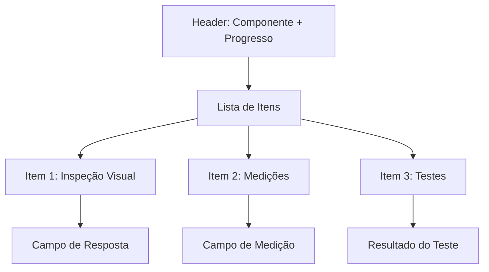

# Wireframe: Interface de Diagnóstico

## Visão Geral
Interface guiada para execução de diagnósticos com checklists dinâmicos por tipo de motor e componente.

## Fluxo de Telas


## Tela 1: Seleção de Ordem

### Layout Desktop
```
┌────────────────────────────────────────┐
│  Diagnóstico - Seleção de OS           │
├────────────────────────────────────────┤
│                                        │
│  [Dropdown: Selecione uma Ordem]      │
│                                        │
│  Ordem #123 - Cliente XYZ - Motor ABC │
│                                        │
│  [Próximo →]                           │
└────────────────────────────────────────┘
```

**Elementos**:
- Título da etapa
- Dropdown de seleção com busca
- Informações da ordem selecionada
- Botão "Próximo" (desabilitado até seleção)

## Tela 2: Seleção de Componente

### Grid de Componentes
```
┌─────────┬─────────┬─────────┐
│ 🔧      │ ⚙️      │ 🏭      │
│ BLOCO   │ EIXO    │ CABEÇOTE│
└─────────┴─────────┴─────────┘
┌─────────┬─────────┬─────────┐
│ 🔩      │ 📐      │ 🛠️      │
│ BIELA   │ COMANDO │ PISTÃO  │
└─────────┴─────────┴─────────┘
```

**Características**:
- Cards clicáveis com ícones
- Destaque visual ao hover
- Badge com status se já diagnosticado
- Layout responsivo (3 cols desktop, 2 tablet, 1 mobile)

## Tela 3: Checklist Interativo

### Estrutura Principal



### Layout Detalhado

```
┌───────────────────────────────────────────┐
│ Diagnóstico: BLOCO DO MOTOR        [X]    │
│ Progresso: ████████░░ 75% (15/20)         │
├───────────────────────────────────────────┤
│                                           │
│ ☑ 1. Inspeção Visual Externa             │
│   └─ Estado: Bom / Regular / Ruim        │
│   └─ Observações: [Texto livre]           │
│                                           │
│ ☑ 2. Verificação de Trincas              │
│   └─ Possui trincas? Sim / Não           │
│   └─ Localização: [Se sim]                │
│   └─ 📸 [Adicionar Foto]                  │
│                                           │
│ □ 3. Medição de Planicidade              │
│   └─ Valor medido: [___] mm              │
│   └─ Tolerância: 0.05mm                   │
│   └─ Status: ✓ OK / ⚠️ Atenção / ✗ Fora │
│                                           │
│ ├─ Serviços Sugeridos ─────────────────┤ │
│ │ ▶ Retífica de Bloco (R$ 450,00)      │ │
│ │   Baseado em: Item 3 - Fora de spec  │ │
│ └────────────────────────────────────────│
│                                           │
│ [← Anterior]  [Salvar Rascunho]  [Próximo →]│
└───────────────────────────────────────────┘
```

### Tipos de Campos

#### Checkbox Simples
```
☑ Item aprovado
□ Item reprovado
```

#### Seleção Única (Radio)
```
○ Opção A
● Opção B  (selecionada)
○ Opção C
```

#### Seleção Múltipla
```
☑ Componente 1
☑ Componente 2
□ Componente 3
```

#### Campo Numérico com Validação
```
Medida: [12.5] mm
Tolerância: 10 - 15 mm
Status: ✓ Dentro da tolerância
```

#### Texto Livre
```
┌────────────────────────────┐
│ Observações adicionais...  │
│                            │
│                            │
└────────────────────────────┘
```

## Tela 4: Upload de Fotos

### Interface de Upload

```
┌────────────────────────────────────┐
│  Fotos do Diagnóstico              │
├────────────────────────────────────┤
│                                    │
│  ┌──────────────────────────────┐ │
│  │  Arraste fotos aqui ou        │ │
│  │  [Clique para Selecionar]    │ │
│  │                               │ │
│  │  📷 Formatos: JPG, PNG        │ │
│  │  ⚠️ Máximo: 10MB por foto     │ │
│  └──────────────────────────────┘ │
│                                    │
│  Fotos Adicionadas:                │
│  ┌─────┬─────┬─────┬─────┐        │
│  │ [x] │ [x] │ [x] │ [x] │        │
│  │ IMG1│ IMG2│ IMG3│ IMG4│        │
│  └─────┴─────┴─────┴─────┘        │
│                                    │
│  [Continuar sem Fotos] [Próximo →]│
└────────────────────────────────────┘
```

**Funcionalidades**:
- Drag & drop
- Preview de miniaturas
- Remover fotos
- Associação automática ao diagnóstico

## Tela 5: Geração de Orçamento

### Resumo e Conversão

```
┌─────────────────────────────────────┐
│  Resumo do Diagnóstico              │
├─────────────────────────────────────┤
│                                     │
│  Componente: BLOCO DO MOTOR         │
│  Status Geral: ⚠️ Necessita Reparo  │
│  Itens Verificados: 20              │
│  Não Conformidades: 3               │
│                                     │
│  ├─ Serviços Necessários ─────────┤│
│  │ ✓ Retífica de Bloco    R$ 450   ││
│  │ ✓ Teste Hidrostático   R$ 120   ││
│  │ ✓ Pintura              R$ 180   ││
│  │ ─────────────────────────────── ││
│  │ TOTAL                  R$ 750   ││
│  └────────────────────────────────┘ │
│                                     │
│  [Editar Serviços]                  │
│  [Gerar Orçamento Formal]           │
│  [Concluir Diagnóstico]             │
└─────────────────────────────────────┘
```

## Estados da Interface

### Loading
```
[⌛] Carregando checklist...
```

### Validação em Tempo Real
```
✓ Item validado
⚠️ Atenção necessária
✗ Fora de especificação
```

### Progresso
```
██████████░░░░░░░░░░ 50%
10 de 20 itens completos
```

## Interações Principais

### Preenchimento de Item
1. Usuário marca checkbox/radio
2. Campos relacionados aparecem/desaparecem
3. Validação automática
4. Sugestão de serviço (se aplicável)
5. Progresso atualiza

### Upload de Foto
1. Drag & drop ou clique
2. Validação de formato/tamanho
3. Preview imediato
4. Associação ao item do checklist

### Navegação
- **Próximo**: Vai para próximo item não preenchido
- **Anterior**: Volta ao item anterior
- **Salvar Rascunho**: Salva e permite retornar depois
- **Concluir**: Finaliza e gera sumário

## Layout Responsivo

### Mobile (< 768px)
- Cards empilhados verticalmente
- Botões em largura total
- Upload de foto otimizado
- Teclado numérico para medições

### Tablet (768px - 1023px)
- Grid 2 colunas em componentes
- Checklist em coluna única
- Fotos em grid 2x2

### Desktop (>= 1024px)
- Grid 3 colunas em componentes
- Checklist com sidebar de progresso
- Fotos em grid 4x4

## Acessibilidade

- ✅ Formulários com labels claros
- ✅ Validação com mensagens descritivas
- ✅ Navegação por teclado
- ✅ ARIA labels em ícones
- ✅ Contraste adequado em todos os estados

## Performance

- Lazy loading de checklists
- Debounce em campos de texto
- Compressão automática de imagens
- Cache de respostas parciais
- Auto-save a cada 30 segundos

---

**Última atualização**: 2025-10-09  
**Versão**: 1.0
