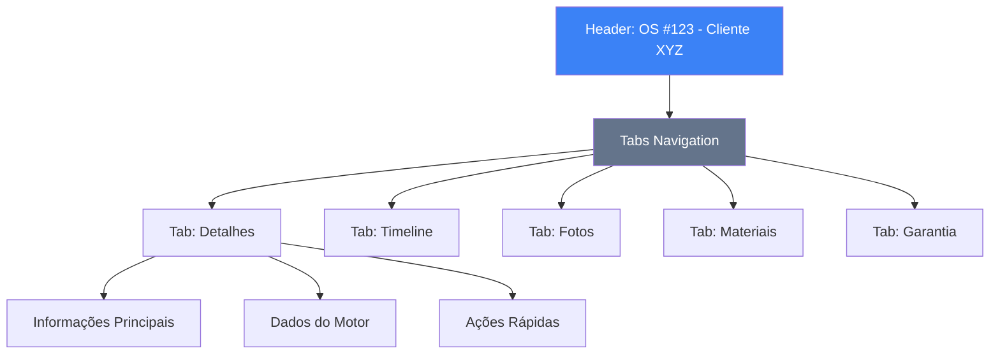
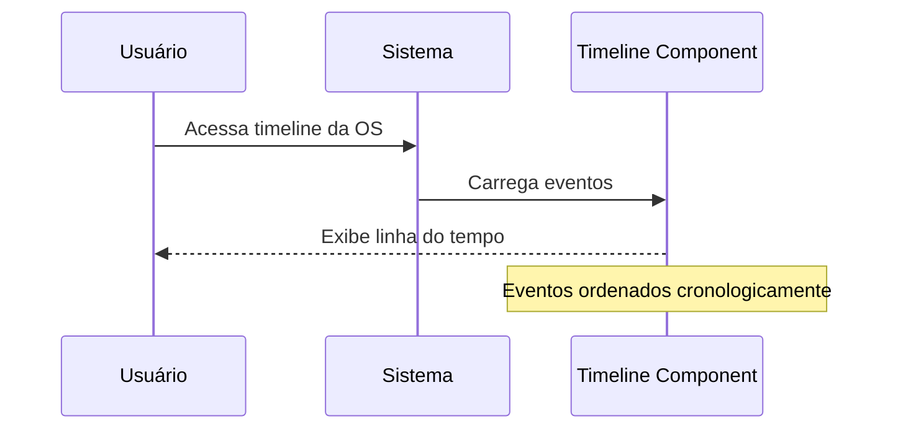

# Wireframe: Detalhes da Ordem de Serviço

## Visão Geral
Interface completa para visualização e edição dos detalhes de uma ordem de serviço, incluindo abas para Timeline, Fotos, Materiais e Garantia.

## Layout Desktop (1920x1080)



## Componentes Principais

### 1. Header
- **Número da OS**: Destaque em fonte grande
- **Nome do Cliente**: Abaixo do número
- **Status Badge**: Com cores dinâmicas
- **Botão Editar**: Abre modal de edição
- **Botão Imprimir**: Gera PDF

### 2. Tabs Navigation
```
[Detalhes] [Timeline] [Fotos] [Materiais] [Garantia]
```

### 3. Tab: Detalhes

#### Informações Principais (Grid 2 colunas)
- Cliente
- Consultor Responsável
- Data de Coleta
- Local de Coleta
- Motorista
- Prazo de Entrega
- Status Atual

####  Dados do Motor
- Marca / Modelo
- Tipo de Motor
- Número de Série
- Estado de Montagem
- Componentes Presentes (checkboxes visuais)

#### Ações Rápidas
- Avançar Workflow
- Registrar Diagnóstico
- Gerar Orçamento
- Agendar Entrega

### 4. Tab: Timeline



**Estrutura Visual**:
- Linha vertical com marcadores
- Cards de eventos expandíveis
- Ícones por tipo de evento
- Timestamp e usuário responsável
- Descrição do evento

### 5. Tab: Fotos

**Layout Grid 4 colunas**:
- Upload de novas fotos (drag & drop)
- Miniaturas clicáveis
- Lightbox para visualização ampliada
- Filtro por componente
- Filtro por etapa do workflow
- Download individual ou em lote

### 6. Tab: Materiais

**Tabela de Materiais**:
| Código | Peça | Quantidade | Aplicado | Responsável | Data |
|--------|------|------------|----------|-------------|------|
| P001   | Pistão | 4 | ✓ | João | 10/10/2025 |

- Botão "Aplicar Material"
- Status visual de aplicação
- Rastreabilidade completa

### 7. Tab: Garantia

- **Tempo de Garantia**: Badge com meses
- **Data de Início**: Calculada automaticamente
- **Data de Término**: Baseada nos meses
- **Componentes Cobertos**: Lista com checkboxes
- **Condições**: Texto descritivo
- **Histórico de Reclamações**: Tabela se houver

## Layout Tablet (768x1024)

### Adaptações:
- Header permanece fixo
- Tabs rolam horizontalmente
- Grid de detalhes muda para 1 coluna
- Fotos em grid 2 colunas
- Ações rápidas empilhadas

## Layout Mobile (375x667)

### Adaptações:
- Header compacto
- Tabs como dropdown seletor
- Tudo em coluna única
- Fotos em lista vertical
- Botões de ação em largura total
- Timeline otimizada para rolagem

## Estados da Interface

### Loading
```
┌─────────────────────┐
│  [Spinner]          │
│  Carregando ordem...│
└─────────────────────┘
```

### Loaded
- Todos os dados visíveis
- Tabs navegáveis
- Ações habilitadas

### Error
```
┌─────────────────────┐
│  ⚠️ Erro ao carregar│
│  [Tentar Novamente] │
└─────────────────────┘
```

### Empty State (Fotos)
```
┌─────────────────────┐
│  📷                 │
│  Nenhuma foto       │
│  [Upload Fotos]     │
└─────────────────────┘
```

## Interações

### Edição de Dados
1. Usuário clica em "Editar"
2. Modal abre com formulário
3. Campos editáveis
4. Validação em tempo real
5. Botões "Salvar" / "Cancelar"

### Upload de Fotos
1. Drag & drop ou clique
2. Preview imediato
3. Seleção de componente
4. Seleção de etapa
5. Upload automático
6. Miniatura aparece no grid

### Aplicação de Material
1. Clique em "Aplicar Material"
2. Modal com seleção de peça
3. Quantidade aplicada
4. Confirmação
5. Atualização da tabela

## Responsividade

### Breakpoints
- **Desktop**: >= 1024px
- **Tablet**: 768px - 1023px
- **Mobile**: < 768px

### Comportamento
- Touch gestures em mobile/tablet
- Swipe entre tabs em mobile
- Pinch to zoom em fotos
- Long press para ações contextuais

## Acessibilidade

- ✅ Navegação por teclado (Tab, Enter, Esc)
- ✅ Screen reader support
- ✅ Contrast ratio WCAG AA
- ✅ Focus indicators visíveis
- ✅ Labels descritivos
- ✅ ARIA attributes apropriados

## Performance

- Lazy loading de fotos
- Paginação na timeline
- Debounce em buscas/filtros
- Cache de dados já carregados
- Otimização de imagens

---

**Última atualização**: 2025-10-09  
**Versão**: 1.0
