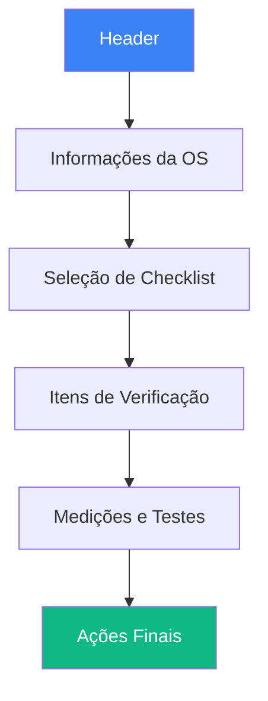
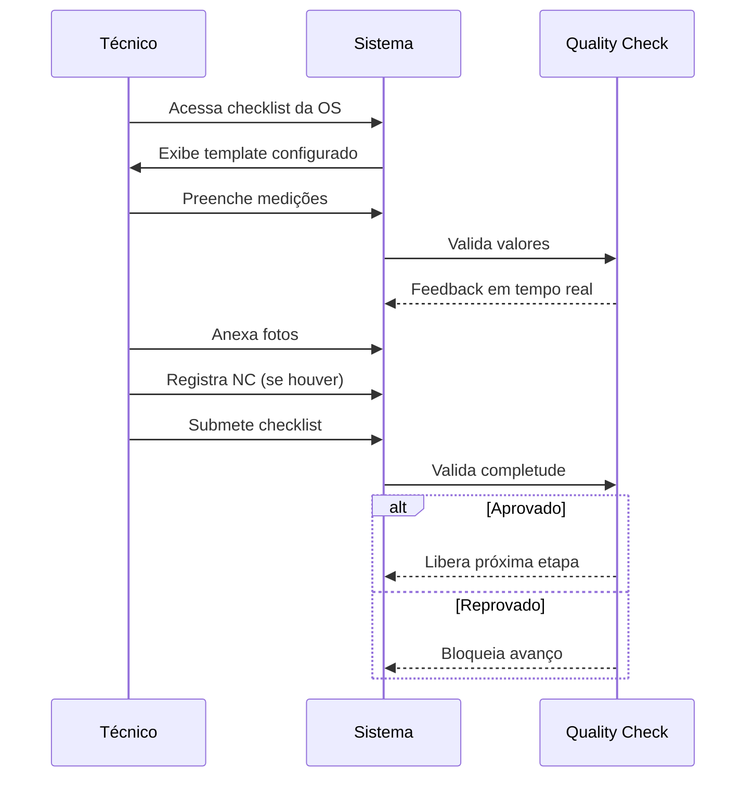

# Wireframe: Interface de Checklists de Qualidade

## Visão Geral
Sistema de checklists de qualidade técnica para validação de serviços executados antes da entrega, incluindo medições, tolerâncias e critérios de aprovação/bloqueio.

## Layout Principal



## Estrutura da Interface

```
┌──────────────────────────────────────────────────────────────┐
│ ✓ Checklist de Qualidade - OS #123                     [X]  │
├──────────────────────────────────────────────────────────────┤
│                                                              │
│ Ordem: #123 │ Cliente: XYZ │ Motor: ABC │ Status: Montagem │
│ Responsável: João Silva │ Data: 09/10/2025                  │
├──────────────────────────────────────────────────────────────┤
│                                                              │
│ Checklist: [Dropdown: Checklist Pós-Montagem            ] │
│                                                              │
│ Progresso: ████████░░░░░░░░░░ 60% (12/20 itens)            │
├──────────────────────────────────────────────────────────────┤
│                                                              │
│ ┌────────────────────────────────────────────────────────┐  │
│ │ ☑ 1. INSPEÇÃO VISUAL                                   │  │
│ │ ├─ Componentes instalados corretamente                 │  │
│ │ │  ● Sim  ○ Não  ○ N/A                                │  │
│ │ ├─ Ausência de vazamentos visíveis                     │  │
│ │ │  ● Sim  ○ Não                                        │  │
│ │ └─ ✓ Aprovado                                          │  │
│ └────────────────────────────────────────────────────────┘  │
│                                                              │
│ ┌────────────────────────────────────────────────────────┐  │
│ │ ▶ 2. MEDIÇÕES TÉCNICAS (Clique para expandir)          │  │
│ └────────────────────────────────────────────────────────┘  │
│                                                              │
│ ┌────────────────────────────────────────────────────────┐  │
│ │ ☐ 3. TESTE DE COMPRESSÃO                   [OBRIGATÓRIO]│  │
│ │ ├─ Cilindro 1: [___] psi  Tolerância: 120-150 psi     │  │
│ │ │  Status: ⚠️ Aguardando medição                       │  │
│ │ ├─ Cilindro 2: [___] psi  Tolerância: 120-150 psi     │  │
│ │ ├─ Cilindro 3: [___] psi  Tolerância: 120-150 psi     │  │
│ │ ├─ Cilindro 4: [___] psi  Tolerância: 120-150 psi     │  │
│ │ ├─ Variação máxima entre cilindros: [___] %            │  │
│ │ │  Limite: 10%                                         │  │
│ │ ├─ 📸 [Anexar Foto do Teste]                           │  │
│ │ └─ [Calcular e Validar]                                │  │
│ └────────────────────────────────────────────────────────┘  │
│                                                              │
│ ┌────────────────────────────────────────────────────────┐  │
│ │ ☐ 4. TESTE DE ESTANQUEIDADE                            │  │
│ │ ├─ Pressão aplicada: [___] bar                         │  │
│ │ ├─ Tempo de teste: [___] minutos                       │  │
│ │ ├─ Queda de pressão: [___] bar                         │  │
│ │ │  Máximo permitido: 0.5 bar                           │  │
│ │ ├─ Resultado:                                           │  │
│ │ │  ○ Aprovado  ○ Reprovado  ○ Retest Necessário       │  │
│ │ └─ Observações: [________________]                     │  │
│ └────────────────────────────────────────────────────────┘  │
│                                                              │
│ ┌─ Não Conformidades Encontradas ─────────────────────────┐ │
│ │ ⚠️ Item 3 - Cilindro 2: Compressão abaixo do mínimo    │ │
│ │    Ação Corretiva: [Dropdown: Retificar cilindro     ] │ │
│ │    Responsável: [João Silva                           ] │ │
│ │    [Registrar NC]                                       │ │
│ └────────────────────────────────────────────────────────┘ │
│                                                              │
│ ┌─ Ações Finais ─────────────────────────────────────────┐ │
│ │ Status Final:                                           │ │
│ │ ○ ✓ Aprovado - Liberar para próxima etapa             │ │
│ │ ○ ⚠️ Aprovado com Ressalvas - Informar cliente        │ │
│ │ ● ✗ Reprovado - Bloquear avanço                       │ │
│ │                                                         │ │
│ │ Assinatura Digital:                                     │ │
│ │ ┌──────────────────┐                                   │ │
│ │ │ João Silva       │ Técnico Responsável               │ │
│ │ │ 09/10/2025 14:30│                                    │ │
│ │ └──────────────────┘                                   │ │
│ │                                                         │ │
│ │ [Salvar Rascunho] [Submeter Checklist]                │ │
│ └────────────────────────────────────────────────────────┘ │
└──────────────────────────────────────────────────────────────┘
```

## Componentes Detalhados

### 1. Header da OS
```
┌──────────────────────────────────────┐
│ OS #123 │ Cliente XYZ │ Motor ABC   │
│ Status: Montagem  │  João Silva     │
└──────────────────────────────────────┘
```

### 2. Seleção de Checklist
```
Checklist Aplicável:
[Dropdown com templates por etapa]
- Checklist Pós-Desmontagem
- Checklist Pós-Usinagem
▶ Checklist Pós-Montagem
- Checklist Pré-Entrega
```

### 3. Barra de Progresso
```
████████░░░░░░░░░░ 60%
12 de 20 itens completados
3 aprovados │ 1 reprovado │ 8 pendentes
```

### 4. Item Expansível

#### Estado Collapsed
```
▶ 2. MEDIÇÕES TÉCNICAS
   Status: ⚠️ Pendente │ Obrigatório
```

#### Estado Expanded
```
▼ 2. MEDIÇÕES TÉCNICAS                     [OBRIGATÓRIO]
  ├─ Planicidade do bloco
  │  Valor medido: [0.03] mm
  │  Tolerância: máx 0.05 mm
  │  Status: ✓ OK
  │
  ├─ Ovalização dos cilindros
  │  Cilindro 1: [0.01] mm  Status: ✓ OK
  │  Cilindro 2: [0.08] mm  Status: ✗ FORA
  │  ...
  │
  └─ 📸 [3 fotos anexadas]
     [Ver Fotos] [Adicionar Mais]
```

### 5. Campo de Medição com Validação

```
┌────────────────────────────────────┐
│ Medida: [12.50] mm                 │
│ Tolerância: 12.0 - 13.0 mm         │
│ ┌──────────────────────────────┐   │
│ │ ✓ Dentro da tolerância       │   │
│ │ Cor: Verde                    │   │
│ └──────────────────────────────┘   │
└────────────────────────────────────┘
```

**Estados Possíveis**:
- ✓ Verde: Dentro da tolerância
- ⚠️ Amarelo: Próximo ao limite (90-100%)
- ✗ Vermelho: Fora da especificação

### 6. Upload de Evidências

```
┌────────────────────────────────┐
│ 📸 Evidências Fotográficas     │
├────────────────────────────────┤
│ ┌────┬────┬────┐              │
│ │IMG1│IMG2│ + │              │
│ └────┴────┴────┘              │
│ [Capturar Foto] [Upload]      │
└────────────────────────────────┘
```

### 7. Registro de Não Conformidade

```
┌──────────────────────────────────────┐
│ ⚠️ Não Conformidade Detectada        │
├──────────────────────────────────────┤
│ Item: 3 - Teste de Compressão       │
│ Problema: Compressão abaixo mínimo   │
│                                      │
│ Ação Corretiva: *                    │
│ [Dropdown: Selecione ação        ]  │
│ - Retificar cilindro                │
│ - Substituir anel de segmento       │
│ - Refazer teste                     │
│ - Outro (especificar)               │
│                                      │
│ Responsável pela Correção:           │
│ [João Silva                      ]  │
│                                      │
│ Prazo: [10/10/2025]                 │
│                                      │
│ [Cancelar] [Registrar NC]            │
└──────────────────────────────────────┘
```

### 8. Resultado Final

```
┌────────────────────────────────────┐
│ Status Final do Checklist          │
├────────────────────────────────────┤
│ ○ ✓ APROVADO                       │
│   Todos os critérios atendidos     │
│   Liberar para próxima etapa       │
│                                    │
│ ○ ⚠️ APROVADO COM RESSALVAS        │
│   Alguns itens fora do ideal       │
│   Informar cliente                 │
│                                    │
│ ● ✗ REPROVADO                      │
│   Critérios obrigatórios não OK    │
│   ⛔ Bloquear avanço da OS         │
│                                    │
│ Motivo da Reprovação:              │
│ [Compressão do cilindro 2 abaixo] │
│ [do mínimo aceitável.            ] │
│                                    │
│ [Submeter Avaliação]               │
└────────────────────────────────────┘
```

## Fluxo de Preenchimento



## Estados da Interface

### Loading
```
[⌛] Carregando checklist...
```

### Em Preenchimento
- Campos obrigatórios marcados com *
- Validação em tempo real
- Auto-save a cada 30s

### Validação
```
✓ Item validado
⚠️ Atenção necessária
✗ Fora de especificação
❌ Bloqueio aplicado
```

### Concluído
```
✅ Checklist finalizado
Assinado por: João Silva
Data: 09/10/2025 14:30
Status: APROVADO
```

## Regras de Negócio

### Obrigatoriedade
- Itens marcados como "OBRIGATÓRIO" devem ser preenchidos
- Checklist não pode ser finalizado sem itens obrigatórios
- Campos com validação devem estar dentro da tolerância

### Bloqueios
- Status "REPROVADO" bloqueia avanço no workflow
- Não Conformidades devem ter ações corretivas
- Fotos obrigatórias em itens críticos

### Assinatura Digital
- Técnico responsável deve assinar
- Timestamp automático
- Não editável após assinatura

## Responsividade

### Mobile (< 768px)
- Cards empilhados
- Campos de medição em coluna única
- Teclado numérico para valores
- Upload de foto otimizado

### Tablet (768px - 1023px)
- Layout semi-compactado
- Grid 2 colunas para medições
- Funcionalidades completas

### Desktop (>= 1024px)
- Layout completo conforme mockup
- Sidebar com resumo
- Múltiplas fotos visíveis

## Acessibilidade

- ✅ Labels claros em todos os campos
- ✅ Feedback visual de validação
- ✅ Navegação por teclado
- ✅ Screen reader support
- ✅ Contraste adequado em todos os estados
- ✅ Mensagens de erro descritivas

## Performance

- Auto-save local (localStorage)
- Validação assíncrona
- Lazy loading de fotos
- Compressão de imagens anexadas
- Cache de templates

---

**Última atualização**: 2025-10-09  
**Versão**: 1.0
