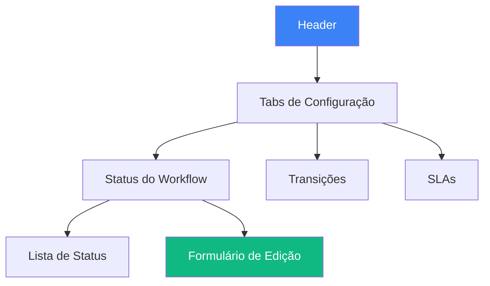
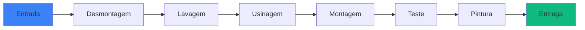

# Wireframe: Painel de Configuração de Workflow

## Visão Geral
Interface administrativa para configurar status personalizados do workflow operacional, incluindo cores, ícones, transições permitidas e SLAs.

## Layout Principal (Desktop 1920x1080)



## Estrutura Visual

```
┌───────────────────────────────────────────────────────────┐
│  ⚙️ Configuração de Workflow         [+ Novo Status]      │
├───────────────────────────────────────────────────────────┤
│ [Status] [Transições] [SLAs]                              │
├─────────────────┬─────────────────────────────────────────┤
│ Lista de Status │ Edição do Status Selecionado            │
│                 │                                         │
│ ┌─────────────┐ │ Nome do Status:                         │
│ │ entrada     │ │ [Entrada de Material                    ]│
│ │ 🔵 Azul     │ │                                         │
│ └─────────────┘ │ Chave Interna (slug):                   │
│                 │ [entrada_material                       ]│
│ ┌─────────────┐ │                                         │
│ │▶ desmontagem│ │ Cor do Badge:                           │
│ │ 🟡 Amarelo  │ │ [Color Picker: #fbbf24               ] │
│ └─────────────┘ │                                         │
│                 │ Ícone:                                  │
│ ┌─────────────┐ │ [Icon Selector: 📦 Package           ] │
│ │ usinagem    │ │                                         │
│ │ 🟣 Roxo     │ │ Ordem de Exibição:                      │
│ └─────────────┘ │ [Spinner: 1                          ] │
│                 │                                         │
│ ┌─────────────┐ │ ☑ Ativo                                │
│ │ montagem    │ │ ☑ Visível no Kanban                    │
│ │ 🟢 Verde    │ │ ☐ Status Final                         │
│ └─────────────┘ │                                         │
│                 │ ┌─────────────────────────────────────┐ │
│ ┌─────────────┐ │ │ Preview do Badge                    │ │
│ │ entrega     │ │ │ ┌──────────────┐                    │ │
│ │ ⚫ Cinza    │ │ │ │📦 Entrada    │                    │ │
│ └─────────────┘ │ │ └──────────────┘                    │ │
│                 │ └─────────────────────────────────────┘ │
│                 │                                         │
│ [+ Novo Status] │ [Cancelar]  [Salvar Alterações]        │
└─────────────────┴─────────────────────────────────────────┘
```

## Tab 1: Status do Workflow

### Lista de Status (Esquerda)

**Card de Status**:
```
┌────────────────────────┐
│ 🔵 entrada_material    │
│ Entrada de Material    │
│ Ordem: 1 │ ✓ Ativo     │
│ [✏️ Editar] [🗑️ Excluir]│
└────────────────────────┘
```

**Características**:
- Drag & drop para reordenar
- Indicador visual de cor
- Status ativo/inativo
- Ações rápidas (editar/excluir)

### Formulário de Edição (Direita)

#### Campo: Nome do Status
```
Nome do Status: *
[_______________________________]
Texto exibido para os usuários
```

#### Campo: Chave Interna
```
Chave Interna (slug): *
[_______________________________]
Usado no código (snake_case)
⚠️ Não altere após criação
```

#### Campo: Cor do Badge
```
Cor do Badge: *
┌─────────────────────────────┐
│ [🎨]  #3b82f6               │
│ ┌───┬───┬───┬───┬───┬───┐  │
│ │ █ │ █ │ █ │ █ │ █ │ █ │  │
│ └───┴───┴───┴───┴───┴───┘  │
│ Azul | Verde | Vermelho... │
└─────────────────────────────┘
```

#### Campo: Ícone
```
Ícone: *
┌──────────────────────────┐
│ [🔍] Buscar ícone...    │
├──────────────────────────┤
│ 📦 Package               │
│ 🔧 Wrench                │
│ ⚙️ Settings              │
│ 🚀 Rocket                │
│ ✓ Check                  │
│ ...                      │
└──────────────────────────┘
```

#### Campo: Ordem de Exibição
```
Ordem de Exibição: *
[▼] [1] [▲]
Define a sequência no Kanban
```

#### Checkboxes de Configuração
```
☑ Ativo
  Status disponível para uso

☑ Visível no Kanban
  Aparece como coluna no board

☐ Status Final
  Marca conclusão do workflow
```

#### Preview em Tempo Real
```
┌────────────────────────────┐
│ Preview do Badge           │
│ ┌────────────┐             │
│ │ 📦 Entrada │ (Badge)     │
│ └────────────┘             │
│                            │
│ Como aparecerá no sistema  │
└────────────────────────────┘
```

## Tab 2: Transições

### Interface de Transições

```
┌──────────────────────────────────────────────┐
│ Configurar Transições Permitidas             │
├──────────────────────────────────────────────┤
│                                              │
│ De: [Dropdown: Selecione status origem    ] │
│                                              │
│ Para: (selecione os status permitidos)       │
│ ☑ Desmontagem                               │
│ ☑ Lavagem                                   │
│ ☐ Usinagem (pular etapa)                    │
│ ☐ Entrega (pular diretamente)               │
│                                              │
│ Regras Especiais:                            │
│ ☑ Exigir diagnóstico completo               │
│ ☑ Validar orçamento aprovado                │
│ ☐ Notificar cliente                         │
│                                              │
│ [Salvar Transições]                          │
└──────────────────────────────────────────────┘
```

### Diagrama Visual de Transições



## Tab 3: SLAs (Service Level Agreements)

### Configuração de Prazos

```
┌────────────────────────────────────────────┐
│ Configuração de SLAs por Status            │
├────────────────────────────────────────────┤
│                                            │
│ Status: [Dropdown: Desmontagem          ] │
│                                            │
│ Prazo Padrão:                              │
│ [▼] [2] [▲] dias úteis                     │
│                                            │
│ Alertas:                                   │
│ ⚠️ Avisar quando atingir:                  │
│ [▼] [75] [▲] % do prazo                    │
│                                            │
│ 🔔 Notificar:                              │
│ ☑ Responsável da ordem                     │
│ ☑ Supervisor da operação                   │
│ ☐ Cliente (email)                          │
│                                            │
│ Exceções por Tipo de Motor:                │
│ ┌──────────────────────────────────┐      │
│ │ Motor Diesel Grande Porte: 3 dias │      │
│ │ Motor Gasolina Comum:     1 dia  │      │
│ └──────────────────────────────────┘      │
│ [+ Adicionar Exceção]                      │
│                                            │
│ [Salvar SLAs]                              │
└────────────────────────────────────────────┘
```

## Modal: Novo Status

```
┌──────────────────────────────────┐
│ Criar Novo Status de Workflow    │
├──────────────────────────────────┤
│                                  │
│ Nome do Status: *                │
│ [_____________________________] │
│                                  │
│ Chave Interna: *                 │
│ [_____________________________] │
│ (gerado automaticamente)         │
│                                  │
│ Usar Template:                   │
│ ○ Criar do zero                  │
│ ● Copiar de existente:           │
│   [Dropdown: Desmontagem      ] │
│                                  │
│ [Cancelar]  [Criar Status]       │
└──────────────────────────────────┘
```

## Interações e Comportamento

### Criar Novo Status
1. Clique em "+ Novo Status"
2. Modal abre
3. Preenche dados
4. Opcionalmente copia configuração
5. Salva
6. Aparece na lista

### Editar Status Existente
1. Clique em status na lista
2. Formulário carrega dados
3. Preview atualiza em tempo real
4. Salvar aplica mudanças

### Reordenar Status
1. Drag & drop na lista
2. Ordem atualiza automaticamente
3. Reflete no Kanban

### Excluir Status
1. Clique em excluir
2. Confirmação:
   ```
   ⚠️ Tem certeza?
   Este status será removido.
   Ordens neste status serão movidas para:
   [Dropdown: selecione destino]
   [Cancelar] [Confirmar Exclusão]
   ```

## Validações

### Ao Salvar Status
- ✓ Nome obrigatório
- ✓ Chave única
- ✓ Cor válida (hexadecimal)
- ✓ Ícone selecionado
- ✓ Ordem numérica

### Ao Configurar Transições
- ⚠️ Pelo menos uma transição de saída
- ⚠️ Sem ciclos infinitos
- ⚠️ Status final não pode ter transições de saída

## Responsividade

### Mobile (< 768px)
- Lista e formulário em tabs separadas
- Color picker simplificado
- Icon selector em modal fullscreen

### Tablet (768px - 1023px)
- Layout vertical (lista acima, formulário abaixo)
- Funcionalidades completas

### Desktop (>= 1024px)
- Layout lado a lado (conforme mockup)
- Todas as funcionalidades visíveis

## Acessibilidade

- ✅ Navegação por teclado completa
- ✅ Labels descritivos em todos os campos
- ✅ Feedback visual de validação
- ✅ Screen reader friendly
- ✅ Contraste adequado (WCAG AA)

## Performance

- Debounce no preview (300ms)
- Auto-save de configurações
- Cache de ícones disponíveis
- Validação assíncrona

---

**Última atualização**: 2025-10-09  
**Versão**: 1.0
