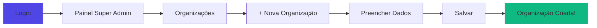
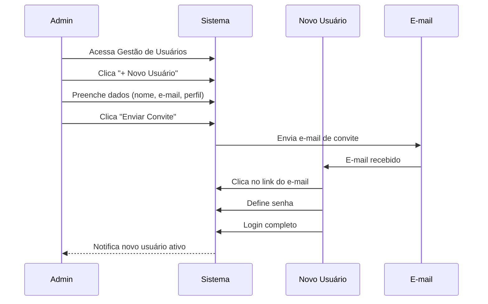
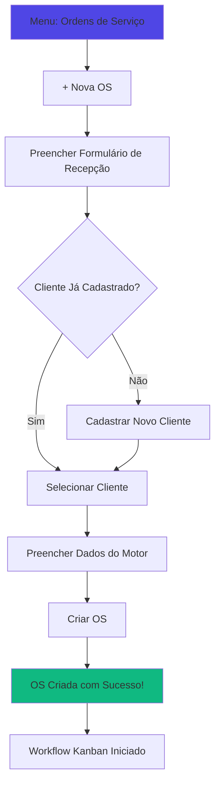

# 🚀 Guia de Início Rápido - ERP Retífica

## 📋 Índice
- [Primeiro Acesso](#primeiro-acesso)
- [Criar Organização](#criar-organização)
- [Adicionar Usuários](#adicionar-usuários)
- [Configurar Perfis e Setores](#configurar-perfis-e-setores)
- [Criar Primeira Ordem de Serviço](#criar-primeira-ordem-de-serviço)
- [Atalhos e Dicas](#atalhos-e-dicas)

---

## 🔐 Primeiro Acesso

### Passo 1: Login

1. Acesse a URL do sistema
2. Clique em **"Entrar"**
3. Digite seu **e-mail** e **senha**
4. Clique em **"Acessar Sistema"**

> 💡 **Dica**: Se não possui conta, solicite ao administrador do sistema para criar seu acesso.

### Passo 2: Recuperar Senha (se necessário)

1. Na tela de login, clique em **"Esqueci minha senha"**
2. Digite seu e-mail cadastrado
3. Verifique sua caixa de entrada
4. Clique no link recebido
5. Defina uma nova senha (mínimo 8 caracteres)

---

## 🏢 Criar Organização

### Para Super Admins

### Passo a Passo

1. **Acesse o Painel Super Admin**
   - Clique no ícone de engrenagem no canto superior direito
   - Selecione **"Super Admin"**

2. **Criar Nova Organização**
   - Clique em **"+ Nova Organização"**
   - Preencha os campos:
     - **Nome da Empresa**: Ex: "Retífica Modelo S.A."
     - **CNPJ**: 00.000.000/0000-00
     - **Endereço** (opcional)
     - **Telefone** (opcional)
     - **E-mail** (opcional)

3. **Configurações Iniciais**
   - **Status**: Ativa
   - **Plano**: Selecione o plano contratado
   - **Data de Início**: Data de hoje

4. **Salvar**
   - Clique em **"Criar Organização"**
   - Aguarde a confirmação
   - ✅ Organização criada com sucesso!

---

## 👥 Adicionar Usuários

### Fluxo de Criação de Usuário

### Passo a Passo

1. **Acessar Gestão de Usuários**
   - Menu lateral: **"Configurações" > "Gestão de Usuários"**
   - Ou busque por **"Usuários"** na busca global (Ctrl + K)

2. **Adicionar Novo Usuário**
   - Clique no botão **"+ Novo Usuário"**
   - Preencha o formulário:
     - **Nome Completo**: Ex: "João Silva"
     - **E-mail**: joao.silva@empresa.com.br
     - **Perfil**: Selecione o perfil adequado (Admin, Gerente, Operador, etc.)
     - **Setor** (opcional): Ex: "Produção"
     - **Status**: Ativo

3. **Enviar Convite**
   - Clique em **"Enviar Convite"**
   - O usuário receberá um e-mail para definir senha
   - ✅ Usuário convidado com sucesso!

### Perfis Disponíveis

| Perfil | Descrição | Permissões |
|--------|-----------|-----------|
| **Owner** | Dono da organização | Acesso total, configurações gerais |
| **Admin** | Administrador | Gestão de usuários, configurações de módulos |
| **Manager** | Gerente | Supervisão, aprovações, relatórios |
| **Operator** | Operador | Execução de tarefas, registro de dados |
| **Viewer** | Visualizador | Apenas visualização, sem edições |

---

## 🔐 Configurar Perfis e Setores

### Criar Perfil Customizado

1. **Acessar Gestão de Perfis**
   - Menu: **"Configurações" > "Gestão de Perfis de Usuários"**

2. **Criar Novo Perfil**
   - Clique em **"+ Novo Perfil"**
   - Preencha:
     - **Nome do Perfil**: Ex: "Supervisor de Produção"
     - **Descrição**: "Supervisiona equipe de produção"

3. **Configurar Permissões**
   - Marque os módulos que o perfil terá acesso:
     - ✅ Dashboard (Visualizar)
     - ✅ Operações (Visualizar + Editar)
     - ✅ Orçamentos (Visualizar)
     - ❌ Fiscal (Sem acesso)
     - ❌ Financeiro (Sem acesso)

4. **Salvar Perfil**
   - Clique em **"Criar Perfil"**
   - ✅ Perfil criado!

### Criar Setor

1. **Acessar Gestão de Setores**
   - Menu: **"Configurações" > "Gestão de Perfis de Usuários"** > Aba **"Setores"**

2. **Adicionar Setor**
   - Clique em **"+ Novo Setor"**
   - Preencha:
     - **Nome**: Ex: "Montagem"
     - **Descrição**: "Equipe responsável pela montagem de motores"

3. **Associar Usuários**
   - Selecione os usuários que fazem parte deste setor
   - Clique em **"Salvar"**

---

## 📋 Criar Primeira Ordem de Serviço

### Fluxo Completo de Criação de OS

### Passo 1: Acessar Ordens de Serviço

- Menu lateral: **"Operações" > "Ordens de Serviço"**
- Ou pressione **Ctrl + K** e busque "OS"

### Passo 2: Nova OS

1. Clique no botão **"+ Nova Ordem de Serviço"**

### Passo 3: Selecionar ou Cadastrar Cliente

**Se o cliente JÁ existe:**
- Digite o nome ou CPF/CNPJ no campo de busca
- Selecione o cliente da lista

**Se o cliente é NOVO:**
1. Clique em **"+ Cadastrar Novo Cliente"**
2. Preencha:
   - **Tipo**: Pessoa Física ou Jurídica
   - **Nome/Razão Social**
   - **CPF/CNPJ**
   - **Telefone**
   - **E-mail** (opcional)
   - **Endereço** (opcional)
3. Se for oficina/frota:
   - Marque **"Cliente é Oficina/Frota"**
   - Preencha dados da oficina
4. Clique em **"Salvar Cliente"**

### Passo 4: Dados do Motor

Preencha as informações do motor recebido:

**Informações Básicas:**
- **Marca**: Ex: Mercedes-Benz, Volvo, Scania, MWM
- **Modelo**: Ex: OM457, D12, DC13
- **Tipo de Combustível**: Diesel, Gasolina, Flex
- **Número de Série** (opcional)

**Estado do Motor:**
- ✅ **Motor Completo?** (Sim/Não)
- ✅ **Possui Bloco?**
- ✅ **Possui Cabeçote?**
- ✅ **Possui Virabrequim?**
- ✅ **Possui Bielas?**
- ✅ **Possui Pistões?**
- ✅ **Gira Manualmente?** (Importante para diagnóstico)

**Observações:**
- Campo livre para notas importantes
- Ex: "Motor apresenta ruídos no virabrequim, óleo escuro"

### Passo 5: Criar OS

1. Revise todos os dados preenchidos
2. Clique em **"Criar Ordem de Serviço"**
3. ✅ OS criada com sucesso!

### Passo 6: O que acontece em seguida?

Automaticamente:
- OS é criada com número sequencial (ex: OS-2025-0001)
- Workflow Kanban é iniciado com 5 componentes:
  - Bloco
  - Eixo/Virabrequim
  - Biela
  - Comando de Válvulas
  - Cabeçote
- Cada componente inicia no status **"Entrada"**
- OS fica visível no Kanban para a equipe

---

## 📊 Navegar pelo Dashboard

### Elementos Principais

1. **KPIs no Topo**
   - Total de Ordens
   - Ordens Pendentes
   - Receita do Mês
   - Satisfação do Cliente

2. **Tabs**
   - **Dashboard**: Visão geral
   - **Performance**: Métricas e metas
   - **Gamificação**: Conquistas e rankings
   - **Compras**: Necessidades de compra

3. **Notificações**
   - Clique no ícone de sino (🔔) no topo
   - Veja alertas importantes
   - Marque como lido

4. **Busca Global**
   - Pressione **Ctrl + K** (Windows/Linux) ou **Cmd + K** (Mac)
   - Digite o que procura
   - Acesse rapidamente qualquer página

---

## 💡 Atalhos e Dicas Úteis

### Atalhos de Teclado

| Atalho | Ação |
|--------|------|
| **Ctrl + K** / **Cmd + K** | Busca global |
| **Ctrl + /** | Abrir menu de atalhos |
| **Esc** | Fechar modais |
| **Alt + 1-9** | Navegar para menu 1-9 |

### Dicas de Navegação

✅ **Use a Busca Global**: Mais rápido que navegar pelos menus  
✅ **Favoritos**: Adicione páginas frequentes aos favoritos  
✅ **Filtros**: Todos os listagens possuem filtros avançados  
✅ **Exportar**: Exporte dados para Excel em qualquer tabela  

### Dicas de Produtividade

1. **Configure Notificações**: Receba alertas apenas do que importa
2. **Personalize o Dashboard**: Organize os KPIs que você mais usa
3. **Use Templates**: Crie modelos de orçamentos para agilizar
4. **Atalhos Rápidos**: Configure ações rápidas no dashboard

---

## 🆘 Precisa de Ajuda?

### Documentação Completa

- 📘 [Glossário de Termos](./glossary.md)
- ❓ [Perguntas Frequentes](./faq.md)
- 🔄 [Fluxos de Usuários Completos](./user-flows/complete-user-journeys.md)
- 🔒 [Matriz de Permissões](./user-flows/permissions-matrix.md)
- ✅ [Guia de Validação](./validation/functional-validation-guide.md)

### Suporte

- **E-mail**: suporte@erpretifica.com.br
- **Chat**: Disponível no canto inferior direito
- **WhatsApp**: (11) 99999-9999

---

**Última Atualização**: 2025-01-14  
**Versão**: 3.0.0
