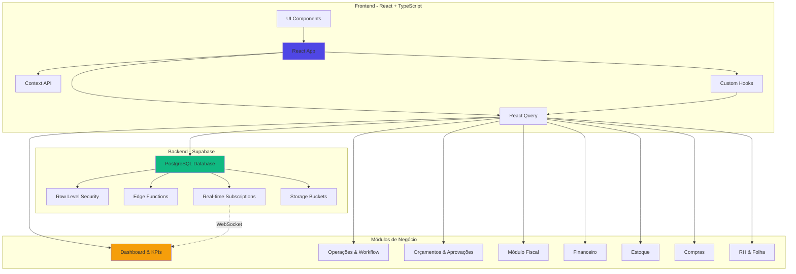
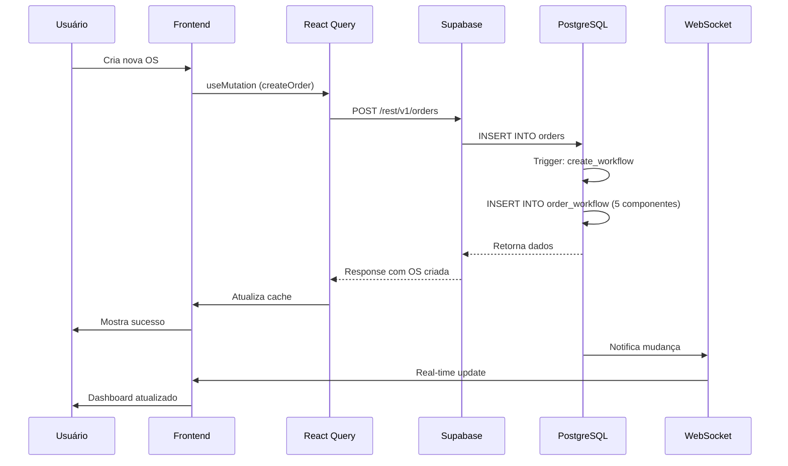
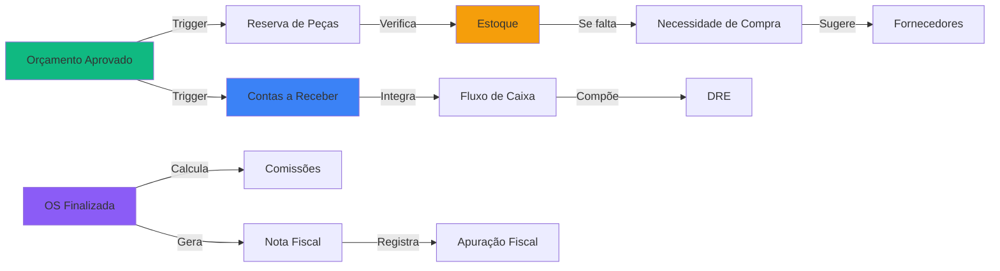
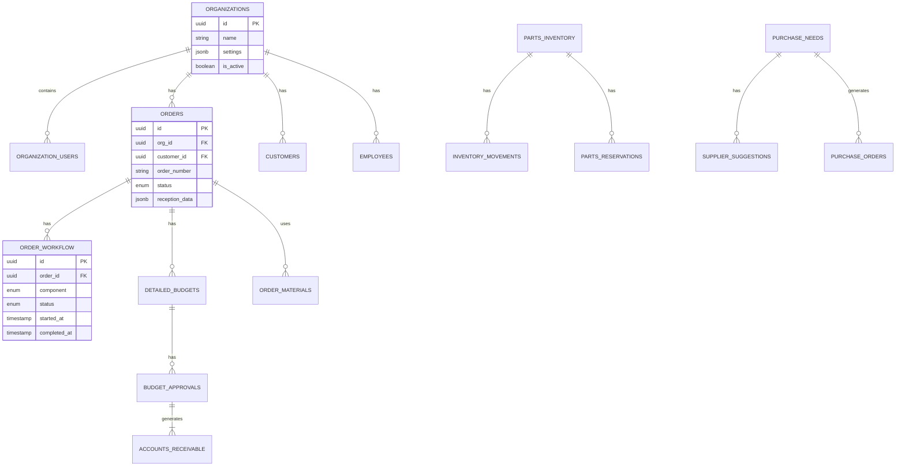

# 🏗️ Blueprint Arquitetural do Sistema ERP Retífica

## 📋 Índice
- [Visão Geral](#visão-geral)
- [Arquitetura Geral](#arquitetura-geral)
- [Stack Tecnológico](#stack-tecnológico)
- [Módulos Implementados](#módulos-implementados)
- [Fluxo de Dados](#fluxo-de-dados)
- [Modelo de Dados](#modelo-de-dados)
- [Segurança e RLS](#segurança-e-rls)
- [Padrões de Desenvolvimento](#padrões-de-desenvolvimento)

---

## 🎯 Visão Geral

O **ERP Retífica** é um sistema completo de gestão empresarial desenvolvido especificamente para retíficas de motores, com suporte a múltiplas organizações (multi-tenant), gestão de workflows operacionais, módulos fiscais e financeiros integrados.

### Características Principais

✅ **Multi-tenancy**: Isolamento total de dados entre organizações  
✅ **Sistema de Permissões Granular**: Perfis e setores customizáveis  
✅ **Workflow Kanban Configurável**: 14 etapas operacionais  
✅ **Módulo Fiscal Completo**: Apuração automática de impostos  
✅ **Dashboard em Tempo Real**: KPIs atualizados via WebSocket  
✅ **Gamificação**: Sistema de conquistas e rankings  
✅ **Responsivo**: Funcional em desktop, tablet e mobile  

---

## 🏛️ Arquitetura Geral



---

## 🛠️ Stack Tecnológico

### Frontend
| Tecnologia | Versão | Uso |
|-----------|--------|-----|
| **React** | 18.3.1 | Framework principal |
| **TypeScript** | 5.x | Tipagem estática |
| **Vite** | 5.x | Build tool |
| **TailwindCSS** | 3.x | Estilização |
| **shadcn/ui** | Latest | Componentes UI |
| **React Query** | 5.x | State management assíncrono |
| **React Router** | 6.x | Roteamento |
| **Framer Motion** | 12.x | Animações |
| **Recharts** | 2.x | Gráficos e visualizações |
| **Zod** | 3.x | Validação de schemas |
| **date-fns** | 3.x | Manipulação de datas |

### Backend
| Tecnologia | Versão | Uso |
|-----------|--------|-----|
| **Supabase** | 2.x | Backend as a Service |
| **PostgreSQL** | 15+ | Banco de dados |
| **Row Level Security** | Built-in | Segurança de dados |
| **Edge Functions** | Deno | Lógica serverless |
| **Realtime** | Built-in | WebSocket subscriptions |
| **Storage** | Built-in | Armazenamento de arquivos |

### Infraestrutura
- **Hospedagem Frontend**: Lovable.dev
- **Hospedagem Backend**: Supabase Cloud
- **CDN**: Supabase Storage
- **CI/CD**: Automático via Lovable

---

## 📦 Módulos Implementados

### 1. **Dashboard & Visão Geral**
- KPIs em tempo real (WebSocket)
- Sistema de tabs (Dashboard, Performance, Gamificação, Compras)
- Notificações inteligentes
- Ações rápidas configuráveis
- Insights e tendências

📄 [Documentação completa](./business-rules/dashboard-kpis.md)

### 2. **Autenticação & Multi-tenancy**
- Login/logout seguro
- Gestão de organizações
- Super Admin global
- Perfis e setores customizáveis
- Sistema de permissões granular

📄 [Documentação completa](./business-rules/authentication-multitenancy.md)

### 3. **Operações & Workflow**
- Recepção de motores (check-in)
- Diagnóstico com checklists configuráveis
- Workflow Kanban (14 etapas)
- Gestão de componentes (bloco, eixo, biela, comando, cabeçote)
- Ordens de Serviço completas

📄 [Documentação completa](./business-rules/operations-workflow.md)

### 4. **Orçamentos & Aprovações**
- Orçamentos detalhados (serviços + peças)
- Aprovação total/parcial/rejeitada
- Documentação de aprovações
- Integração automática com Contas a Receber
- Gestão de garantias

📄 [Documentação completa](./business-rules/budgets-approval.md)

### 5. **Módulo Fiscal**
- Regimes tributários (Simples, Lucro Real, Presumido)
- Classificações fiscais (NCM, CFOP, CST)
- Cálculo automático de impostos
- Apuração fiscal mensal
- Obrigações acessórias

📄 [Documentação completa](./business-rules/fiscal-module.md)

### 6. **Financeiro**
- Contas a Pagar e Receber
- Fluxo de Caixa
- DRE (Demonstração de Resultado)
- Conciliação bancária
- Centro de custos

📄 [Documentação completa](./business-rules/financial-module.md)

### 7. **Estoque**
- Movimentações (entrada/saída/ajuste)
- Reservas automáticas
- Alertas de estoque baixo
- Contagens físicas
- Rastreabilidade

📄 [Documentação completa](./business-rules/inventory-module.md)

### 8. **Compras**
- Necessidades de compra automáticas
- Sugestões de fornecedores
- Gestão de cotações
- Pedidos de compra
- Recebimento de materiais

📄 [Documentação completa](./business-rules/purchasing-module.md)

### 9. **Recursos Humanos**
- Cadastro de funcionários
- Controle de ponto
- Cálculo de comissões
- Relatórios de produtividade

### 10. **Gamificação**
- Sistema de conquistas
- Rankings de performance
- Pontuação e níveis
- Metas e desafios

---

## 🔄 Fluxo de Dados

### Fluxo Completo de Ordem de Serviço



### Integração entre Módulos



---

## 🗄️ Modelo de Dados Simplificado

### Principais Entidades



### Tabelas Principais (100+ tabelas)

**Core**:
- `organizations` - Organizações (multi-tenant)
- `organization_users` - Usuários por organização
- `user_profiles` - Perfis de usuário
- `user_sectors` - Setores de usuário

**Operações**:
- `orders` - Ordens de serviço
- `engines` - Motores recebidos
- `order_workflow` - Workflow de componentes
- `diagnostic_checklists` - Checklists de diagnóstico
- `diagnostic_checklist_responses` - Respostas de diagnósticos

**Orçamentos**:
- `detailed_budgets` - Orçamentos detalhados
- `budget_approvals` - Aprovações de orçamentos

**Fiscal**:
- `tax_regimes` - Regimes tributários
- `fiscal_classifications` - Classificações fiscais
- `tax_calculations` - Cálculos de impostos
- `fiscal_obligations` - Obrigações acessórias

**Financeiro**:
- `accounts_receivable` - Contas a receber
- `accounts_payable` - Contas a pagar
- `cash_flow` - Fluxo de caixa
- `bank_accounts` - Contas bancárias

**Estoque**:
- `parts_inventory` - Inventário de peças
- `inventory_movements` - Movimentações
- `parts_reservations` - Reservas de peças
- `stock_alerts` - Alertas de estoque

**Compras**:
- `purchase_needs` - Necessidades de compra
- `suppliers` - Fornecedores
- `supplier_suggestions` - Sugestões de fornecedores
- `purchase_orders` - Pedidos de compra

**RH**:
- `employees` - Funcionários
- `employee_time_tracking` - Controle de ponto
- `commission_calculations` - Cálculos de comissões

**Dashboard**:
- `kpis` - Indicadores configuráveis
- `kpi_targets` - Metas de KPIs
- `alerts` - Alertas inteligentes

**Gamificação**:
- `user_achievements` - Conquistas de usuários
- `user_scores` - Pontuações
- `performance_rankings` - Rankings

---

## 🔒 Segurança e RLS

### Row Level Security (RLS)

Todas as tabelas possuem políticas RLS que garantem:

1. **Isolamento por Organização**
```sql
-- Exemplo: usuários só veem dados da própria organização
CREATE POLICY "Users can view their org data"
ON orders FOR SELECT
USING (
  org_id IN (
    SELECT organization_id 
    FROM organization_users 
    WHERE user_id = auth.uid() 
    AND is_active = true
  )
);
```

2. **Controle de Permissões**
```sql
-- Exemplo: apenas admins podem deletar
CREATE POLICY "Only admins can delete"
ON orders FOR DELETE
USING (
  EXISTS (
    SELECT 1 FROM organization_users
    WHERE user_id = auth.uid()
    AND organization_id = orders.org_id
    AND role IN ('admin', 'owner')
  )
);
```

3. **Super Admin Global**
```sql
-- Super admins têm acesso a todas as organizações
CREATE POLICY "Super admins can view all"
ON organizations FOR ALL
USING (is_super_admin());
```

### Níveis de Acesso

| Perfil | Permissões |
|--------|-----------|
| **Super Admin** | Acesso total ao sistema, todas as organizações |
| **Owner** | Admin da organização, configurações gerais |
| **Admin** | Gestão de usuários, configurações de módulos |
| **Manager** | Supervisão de operações, aprovações |
| **Operator** | Execução de tarefas, registro de dados |
| **Viewer** | Apenas visualização |

---

## 📐 Padrões de Desenvolvimento

### Estrutura de Pastas

```
src/
├── components/          # Componentes React
│   ├── ui/             # Componentes shadcn/ui
│   ├── dashboard/      # Componentes do dashboard
│   ├── operations/     # Componentes de operações
│   ├── fiscal/         # Componentes fiscais
│   └── ...
├── hooks/              # Custom hooks
│   ├── useAuth.tsx
│   ├── useDashboard.ts
│   ├── useOrders.ts
│   └── ...
├── pages/              # Páginas (rotas)
├── contexts/           # React contexts
├── services/           # Lógica de negócio
├── utils/              # Utilitários
├── lib/                # Bibliotecas auxiliares
└── integrations/       # Integrações (Supabase)
```

### Convenções de Código

**Componentes**:
```tsx
// PascalCase para componentes
export const OrderCard = ({ order }: OrderCardProps) => {
  return <Card>...</Card>;
};
```

**Hooks**:
```tsx
// use + camelCase para hooks
export const useOrders = () => {
  const { data, isLoading } = useQuery({
    queryKey: ['orders'],
    queryFn: fetchOrders,
  });
  return { orders: data, isLoading };
};
```

**Tipagem**:
```tsx
// Importar tipos do Supabase
import type { Database } from '@/integrations/supabase/types';
type Order = Database['public']['Tables']['orders']['Row'];
```

**Queries com React Query**:
```tsx
// Sempre usar React Query para dados assíncronos
const { data, isLoading, error } = useQuery({
  queryKey: ['resource', id],
  queryFn: () => fetchResource(id),
  staleTime: 5 * 60 * 1000, // 5 minutos
});
```

**Mutations**:
```tsx
const mutation = useMutation({
  mutationFn: createResource,
  onSuccess: () => {
    queryClient.invalidateQueries({ queryKey: ['resources'] });
    toast.success('Criado com sucesso!');
  },
});
```

---

## 🔗 Links Relacionados

- [Guia de Início Rápido](./quick-start.md)
- [Glossário Técnico](./glossary.md)
- [FAQ](./faq.md)
- [Fluxos de Usuários](./user-flows/complete-user-journeys.md)
- [Matriz de Permissões](./user-flows/permissions-matrix.md)
- [Validação Funcional](./validation/functional-validation-guide.md)

---

**Última Atualização**: 2025-01-14  
**Versão**: 3.0.0  
**Mantido por**: Equipe de Desenvolvimento ERP Retífica
